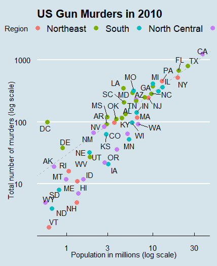

# US-Gun-Murders

# Code
`r <- murders %>%` 
&emsp;&emsp;`summarize(rate = sum(total) / sum(population) * 10^6) %>%` 
&emsp;&emsp;`.$rate` 
    
`murders %>%` 
&emsp;&emsp;`ggplot(aes(population/10^6, total, label = abb)) +` 
&emsp;&emsp;`geom_abline(intercept = log10(r), lty = 2, color = "darkgrey") +` 
&emsp;&emsp;`geom_point(aes(col = region), size = 3) +` 
&emsp;&emsp;`geom_text_repel() +` 
&emsp;&emsp;`scale_x_log10() +` 
&emsp;&emsp;`scale_y_log10() +` 
&emsp;&emsp;`xlab("Population in millions (log scale)") +` 
&emsp;&emsp;`ylab("Total number of murders (log scale)") +` 
&emsp;&emsp;`ggtitle("US Gun Murders in 2010") +` 
&emsp;&emsp;`scale_color_discrete(name = "Region") +` 
&emsp;&emsp;`theme_economist()` 
